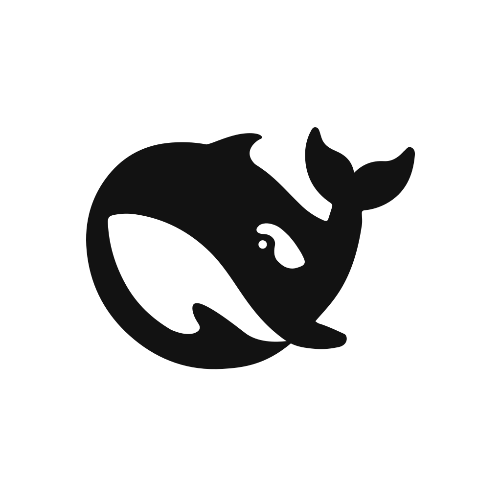
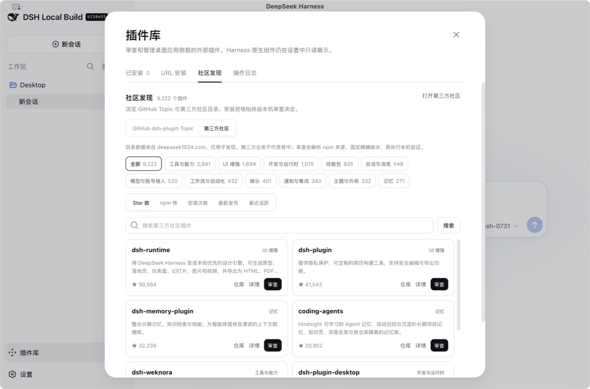
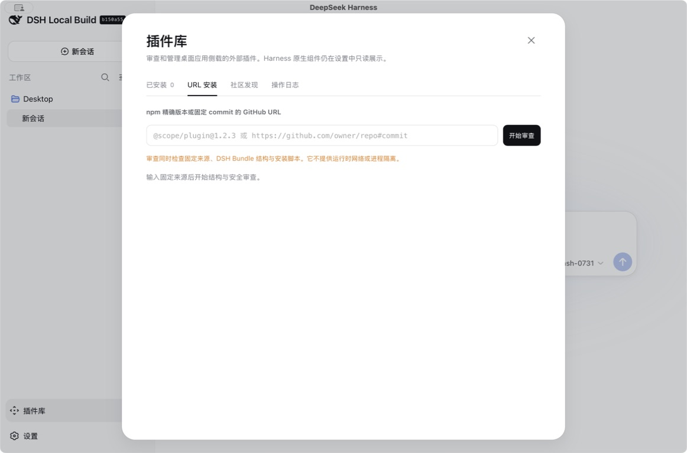

# DeepSeek Harness macOS 桌面版

[English](README.md) | 中文

DeepSeek Harness Desktop 将上游完整的 `dsh web` 体验封装成原生 macOS 应用。它保留 Harness 运行时、profile、Cordis 组合方式和源码目录，在此基础上增加桌面生命周期管理、会话恢复、原生快捷键、源码更新，以及用于侧载外部插件的隔离审查流程。

<p align="center"></p>


> 这是本地 developer preview 构建。应用使用 ad-hoc 签名，不通过 Mac App Store 分发，上游 Harness 变更后可能需要重新构建。

## 桌面版增加的能力

- **原生应用生命周期。** Swift 桌面壳会在操作系统选择的随机 loopback 端口启动仓库构建出的 `dsh web`，等待健康检查通过，再用 WKWebView 嵌入界面，不会额外打开浏览器标签页。一体化透明标题栏会在主内容顶部空白处保留原生拖拽区域，同时避开侧边栏控件。
- **桌面会话行为。** 应用重启后会恢复上次选中的会话。会话菜单增加复制 Session ID、归档和删除，原生“编辑”菜单会把撤销、重做、剪切、复制、粘贴与全选交给当前聚焦的 Web 控件。
- **源码更新与回退。** 更新过程先在分离的 Git worktree 中完成构建和健康检查，再切换活动源码。它不会合并、重置或覆盖当前 checkout，并保留上一源码指针用于回退。
- **模型供应商体验修复。** 供应商配置支持自定义 OpenAI-compatible endpoint，包括本地 `/v1` 服务。模型菜单会用省略号约束过长名称，并避免出现横向滚动条。
- **插件库。** 仅桌面版显示的侧边栏入口会在“已安装”列表展示内置 Bundle，也可发现社区项目、执行本机结构与安全审查、固定不可变来源并记录安装操作。其他 Harness 原生组件仍保留在“设置”中。
- **原生附件选择器。** “文件与文件夹”操作直接打开一个访达面板；该面板可选择普通文件与目录，不经过 Web 中间弹窗。
- **桌面响应式呈现。** 应用保留上游界面，只为插件库增加固定且适配分辨率的画布，不重新设计既有侧边栏或设置页面。

## 内置插件

默认 macOS 应用内置插件库应用界面、[`Deepseek-Files`](../packages/attachment/file-recognizer-office/README.zh.md) 识别 Bundle，以及 [`@deepseek-ai/dsh-model-catalog`](../packages/llm/model-catalog/README.zh.md) 模型能力目录 Bundle。具有随发行版提供的应用前缀的既有 Web profile，会在下次启动时补齐缺失的内置 Bundle，同时保留第三方 Bundle 条目。

## 桌面改动界面

以下截图只展示桌面封装相对上游 Harness 增加或修正的重点，不重复介绍原生界面。

### 会话操作与恢复


会话菜单提供三项桌面版补充操作。重新启动应用时会恢复此前选中的会话，不会每次都创建并选中一个空白新会话。

### 自定义模型供应商


这张文档截图已经隐藏自定义供应商名称。公开供应商和公开模型名称可以保留，但私有供应商标签、Base URL 与 API Key 不应提交到文档。

### 社区发现



社区发现与审查安装相互独立。GitHub 的 [`dsh-plugin` topic](https://github.com/topics/dsh-plugin) 和 [deepseek1024.com](https://deepseek1024.com/) 是两个未经信任的独立目录，分别维护搜索、筛选、分页状态和 15 分钟缓存。进入目录只代表可被发现，不代表具备安装资格；点击卡片的“审查”会带入固定来源并切换到审查安装页。

### 来源审查与兼容分类



审查安装接受精确 npm 版本、固定到 commit hash 的 HTTPS GitHub 仓库，或本地插件目录。本地目录会解析为绝对路径，并在安装前再次检查清单和组合入口；目录内容仍是可变且受信任的本机代码。审查结果分为四类：

- **可直装：** 根目录具有 package 清单，声明 `dsh.bundle.patch`，并引用实际存在的包内 YAML 组合入口。
- **需适配：** 仓库与 Harness 相关，但尚未满足可安装 DSH Bundle 的结构要求。
- **外部项目：** 来源属于应用、服务、library 或其他项目，不是 Harness 插件 bundle。
- **阻止：** 来源可变、格式无效、无法安全检查，或未通过必要的安全校验。

只有“可直装”会生成一次性原生审查 token。如果 npm 发布清单的 `dependencies`、`optionalDependencies` 或 `peerDependencies` 仍含 `workspace:` 版本声明，来源在结构上仍可安装，但审查器会逐项列出受影响的运行时依赖，并要求用户选择“强制安装”或“取消”。“取消”会立即撤销 token；“强制安装”会把未经改写的包交给 pnpm，因此 pnpm 仍可能拒绝无效发布，桌面应用不会为了完成安装而改写第三方包。每个 token 都会在 15 分钟后失效，安装过程仍会禁止依赖 lifecycle script。

### 审查日志


审查、安装、更新、移除与失败结果会追加写入应用支持目录下的 `logs/plugin-audit.jsonl`。日志记录来源、分类、操作、状态、时间和诊断信息，不保存凭据。

## 构建与运行

前置条件是 macOS 13 或更新版本、Swift 6、Node.js `^22.19.0 || >=24.0.0`、Git、librsvg 提供的 `rsvg-convert`，以及首次安装依赖所需的网络连接。在仓库根目录执行：

```sh
npx --yes pnpm@11.7.0 install --frozen-lockfile
npx --yes pnpm@11.7.0 run build
desktop-shell/scripts/build-app.sh
open "desktop-shell/dist/DeepSeek Harness.app"
```

构建脚本会重新创建 `desktop-shell/dist/DeepSeek Harness.app`、生成 `AppIcon.icns`、在资源写入后执行 ad-hoc 签名，并把当前 checkout 记录为初始源码根目录。如果应用复制到另一台 Mac 后该路径不可用，应用会把上游 `master` 分支克隆到 Application Support，并在首次启动前完成构建。

要替换已安装的旧版本，请先退出 DeepSeek Harness，再把新构建的应用复制到 `/Applications/DeepSeek Harness.app`。同级目录中以 `.previous` 结尾的路径是被替换应用的可恢复备份，不是 Harness 用户数据。

运行 `scripts/package-dmg.sh` 可生成 `dist/DeepSeek-Harness-macOS.dmg`。分发构建使用 `ai.deepseek.harness.desktop`，移除开发者 checkout 路径，并且只从已跟踪文件生成内置源码快照。打包时会用插件仓库中的插件库源码与桌面桥替换快照里的上游版本，因此无需修改上游 checkout，也能让安装后的 App 使用带审查流程的安装器。App 构建号变化时，已有的受管理源码快照会在安装依赖前以原子方式替换，profile、API Key、会话和日志仍保留在 Application Support。开发构建继续使用独立的 `ai.deepseek.harness.desktop.local`，因此它保存的源码根目录不会影响已安装的分发版；被忽略的 `.env` 文件和包缓存都不属于构建输入。该磁盘映像仍采用 ad-hoc 签名且未经 notarization。

分发版会优先使用现有 `node` 与同目录 `npx`，前提是 Node.js 版本满足 `^22.19.0 || >=24.0.0`。如果没有兼容工具链，启动流程会下载官方 Node.js 24.16.0 ARM64 归档，校验固定的 SHA-256 摘要，再安装到应用支持目录中的 `tools/node`。该受管理安装不需要管理员权限，也不会替换系统 Node.js；首次安装源码依赖仍需要联网。

## App 图标

可编辑图标源文件应放在仓库的 [`Resources/AppIcon.svg`](Resources/AppIcon.svg)。这样可以保证构建可复现，应用图标也不会依赖 Downloads 中的文件。`scripts/build-app.sh` 会渲染 macOS 所需尺寸、组装 `AppIcon.icns`，并递增 bundle build number，让 Launch Services 刷新图标缓存。生成的 `.icns` 和构建出的 `.app` 都属于产物，不应替代版本库中的 SVG 源文件。

## 数据、日志与源码版本

会话、设置、凭据、profile、插件依赖和桌面日志保存在：

```text
~/Library/Application Support/DeepSeek Harness Desktop/
```

Harness 数据位于其中的 `data` 子目录，与应用 bundle 和源码 worktree 分离。因此源码更新或回退会继续使用同一份会话与设置。回退只切换源码指针，无法撤销上游已经执行的持久数据迁移。

运行时是仓库构建出的 `apps/cli/lib/bin.js`，启动参数固定包含 `--no-open --port 0`。应用必须同时获得 `dsh web` 输出的就绪地址和成功的 HTTP 请求才会打开界面；运行时 warning 会保留在桌面日志中，不会替换启动画面。

## 插件安装与信任

标准“插件”菜单把添加、更新、移除和列表操作委托给官方 `dsh plugin --profile web` 命令。桌面插件库负责发现与审查，再使用仓库固定的 pnpm 版本，把通过审查的安装和移除操作委托给同一命令。

如果某个侧载 Profile Bundle 导致运行时无法就绪，桌面壳会识别其所属的 profile 依赖，并通过只跳过该 Bundle 的临时恢复 profile 重试。已安装 package、`web` profile 和插件文件均不会改变；下次启动应用时仍会再次尝试正常 profile。内置 Bundle 故障以及无法归因到单个侧载依赖的故障仍会作为启动错误处理。

第三方插件会作为可信本机代码执行。Agent 文件操作可以使用 Harness 沙箱，但这不会自动约束插件进程、已配置的 MCP server、网络访问或宿主进程可见性。应逐一审查来源，并把插件更新视为代码更新。

## 安全限制

Web UI 只监听 `127.0.0.1`，外部链接会在默认浏览器中打开，不会替换应用内页面。在 macOS 上，Harness 会使用 Seatbelt 约束支持的 agent 文件效果，Web 默认权限预设从 `workspace-write` 开始。

桌面应用本身没有启用 macOS App Sandbox，因为它需要启动 Node.js、Git、包管理器和 agent 子进程，并访问用户选择的工作区。Docker 默认不启用。后续容器后端可以作为额外的可选隔离层，只挂载明确选择的工作区和持久 Harness 数据，只暴露随机 loopback 端口，并且不挂载 Docker socket。
